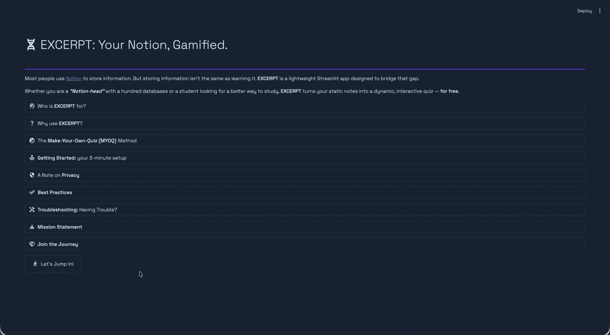
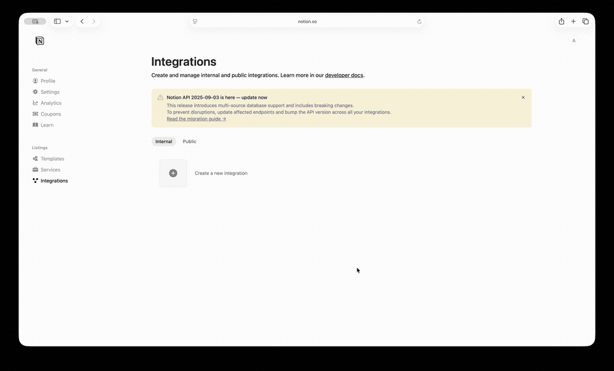
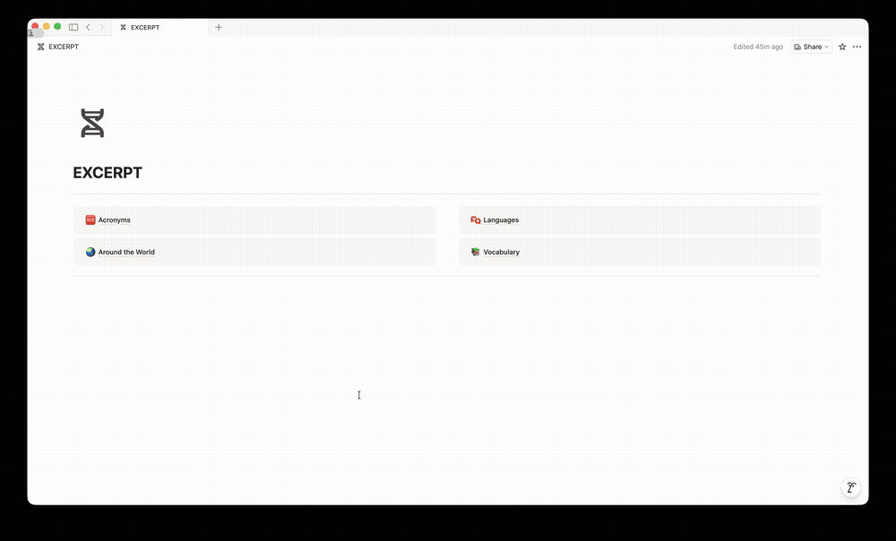

#  EXCERPT: Your Notion, Gamified.
Most people use [Notion](https://notion.so) to store information. But storing information isn't the same as learning it. **EXCERPT** is a lightweight Streamlit app designed to bridge that gap.

Whether you are a **_\"Notion-head\"_** with a hundred databases or a student looking for a better way to study, **EXCERPT** turns your static notes into a dynamic, interactive quiz — **for free**.

  

##  Who is EXCERPT for?
You don't need to be a tech wizard to use **EXCERPT**. If you can type in a table, you can create a curriculum.
* **Language Learners (The Duolingo Duo):** Using Duolingo? When you come across a new word, phrase, or tricky conjugation, drop it into your Notion DB. Use **EXCERPT** to randomly test your recall of those specific phrases later that day.
* **IELTS & TOEFL Aspirants:** Put the "Word" in one column and the "Definition/Synonym" in another. Master vocabulary while waiting for your cab.
* **Corporate Professionals:** Finally memorize those endless company acronyms. Hide the "Meaning" column and test yourself between meetings.
* **Students:** Perfect for Geography (Country vs. Capital), Science (Element vs. Atomic Weight), or History (Event vs. Date).
* **Trivia Buffs:** Build your own database of fun facts while listening to podcasts or traveling.

##  Why use EXCERPT?
* **Active Recall:** Stop mindlessly scrolling your notes. Forcing your brain to "guess" is the fastest way to commit info to long-term memory.
* **Seamless Integration:** Update your database on the Notion mobile app while you're walking or traveling; **EXCERPT** will reflect those changes instantly.
* **Privacy & Cost:** It's your data and your API key. No monthly subscriptions, no "pro" tiers — just you and your brain.
* **Pro Tip:** Keep your Notion app open on your phone to add new rows as you learn them, then use **EXCERPT** on your laptop to drill those same rows later that evening!

##  The Make-Your-Own-Quiz (MYOQ) Method
**EXCERPT** connects to your **Notion Workspace** via an API key and lets you generate **flashcards** from your **Notion Databases**.
1. **Connect:** Input your Notion API Key.
2. **Select:** Pick any database from your workspace.
3. **Customise:** Choose which columns to **Show** (your clues) and which to **Hide** (your answers).
4. **Play:** The app pulls a random row. Look at the clues, make your guess, and reveal the answer!

##  Getting Started: your 3-minute setup
To use **EXCERPT**, you just need to give the app a "secret handshake" with your Notion account. Here's how to set it up for the first time:
1. Create your "Secret Key" (Notion Integration)
    * Go to the [Notion Developers](https://www.notion.so/profile/integrations) page and click the **"+ Create a new integration"** button.
    * Give it a name (like "Excerpt App"), keep the **Type** as **Internal**, and hit **Create**.
    * Under **Associated workspace**, select the **Notion Workspace** you want to connect (that has your databases).
    * Once the integration is created, click on **Configure integration settings** when the pop-up appears.
    * Restrict the integration's capabilities to **Read content** only. This ensures the app can only "see" your data, not modify it.	
    * Under **"Internal integration secret",** click **Show** and then **Copy**. This is your Notion API Key — keep it safe!
2. Edit Access
    * To further restrict the access only to selective pages, switch to **Access** tab, and click on **Edit access**.
    * Check / Uncheck the top-level pages under **Workspace** and/or **Private**.

  

##  A Note on Privacy
Your API Key is only used to fetch your database content. **EXCERPT** does not store your key or your data on any external servers — everything stays between you and your **Notion Workspace**.

##  Best Practices
To make the app truly effective, you need to build your **Notion Databases** for "optimal guessing". If a database is messy, the quiz won't feel right.

Not every **Notion Database** is a good quiz. To get the most out of **EXCERPT**, follow these simple structural tips:
1. **The "One-to-One" Rule:** For the best experience, ensure each row has a clear "Clue" column and a clear "Answer" column.
    * <i>Bad:</i> Putting 5 different definitions in one cell.
    * _Good:_ Creating 5 separate rows for 5 different words.
2. **Use Descriptive Headers:** Name your columns clearly (e.g., "Term," "Definition," "Example Sentence," "Context"). This makes it easier to toggle them.
3. **Keep it Mobile-Friendly:** Since you'll be adding entries while walking or commuting, use **Simple Text** or **Select** properties. Avoid burying your "Answers" inside page icons; **EXCERPT** works best with data visible in the table view.

Example setups to try:
| | Clue Column (SHOW) | Answer Column (HIDE) |
| :--- | :---: | ---: |
| Acronyms | Shortened Words — _FBI_, _NASA_, _URL_, etc. | Full Form |
| Corporate Jargons | Buzzwords — _"circling back"_, _"low hanging fruit"_, _"the elephant in the room"_, etc. | Meaning |
| Data Structures | Algorithm Types — _Binary Tree_, _Linked List_, _Stacks_, etc. | Description |
| Geography | Country Names — _Argentina_, _Maldives_, _Papua New Guinea_, etc. | Capital City |
| Language Learning | Sentences — _"¿Cómo te llamas?"_, _"Terve! Minä olen Ash."_, _"je t\'aime"_, etc. | Translation |

  

##  Troubleshooting: Having Trouble?
If things aren't loading quite right, don't worry! Usually, it's just a quick setting in **Notion** that needs a tweak.

Most issues with the **Notion API** usually boil down to permissions or "sharing" settings.
1. **"My database isn't appearing in the list!"** — This is the most common issue. Even if you've created an API Key, you must explicitly grant access to each database you want to use.
    * **The Fix:** Go to the [Notion Developers](https://www.notion.so/profile/integrations) page and open the **Notion Integration** you created. Switch to **Access** tab → click on **Edit access** → check / uncheck the top-level pages under **Workspace** and / or **Private** (that has your databases).
2. **"The app says 'No Data Found'"** — **EXCERPT** needs a table to read. If your database is empty or only contains "Empty Pages", there's nothing for the app to pick!
    * **The Fix:** Make sure you have at least 1-2 rows with text in the columns you want to hide / show.
3. **"I'm getting a 'Connection Error'"** — Check your internet connection and ensure your **API Key (Internal Integration Secret)** was copied correctly.
    * **The Fix:** Make sure there are no accidental spaces at the beginning or end of the key when you paste it into the app.
4. **"Some columns are missing"** — **EXCERPT** works best with **Text** property.
    * Some complex properties (like 'Select,' 'Multi-select,' 'Number,' and 'Date') can be tricky for the API to read instantly. Stick to simple text columns for the best **"Make-Your-Own-Quiz (MYOQ)"** experience.

**Still stuck?** If you've checked the connections and it's still acting up, try refreshing the Streamlit page. This will reset the connection and fetch a fresh list of your databases.

##  Mission Statement
Why I built **EXCERPT**?

I'm a firm believer that knowledge shouldn't be locked behind a paywall. We spend so much of our lives "collecting" information — saving bookmarks, clipping articles, and typing notes into **Notion**.

But most of that data just sits there, gathering digital dust. I wanted a way to turn those idle moments — like waiting for a bus or sipping a coffee — into active learning sessions.

I built **EXCERPT** because I needed a tool that was:
* **Minimalist:** No clutter, just the quiz.
* **Flexible:** It adapts to your notes, not a pre-set curriculum.
* **Free:** You shouldn't have to pay a subscription to quiz yourself on your own data.

**EXCERPT** is my contribution to the **_\"Notion-head\"_** community and lifelong learners everywhere. It's designed to help you stop just storing information and start owning it.

##  Join the Journey
Created with 💜 using [Streamlit](https://streamlit.io/) and the [Notion API](https://developers.notion.com/reference/intro).

This app is a labor of love and is constantly evolving. If you have a feature request, found a bug, or just want to share how you're using **EXCERPT** to ace your exams or level up your career, I'd love to hear from you!